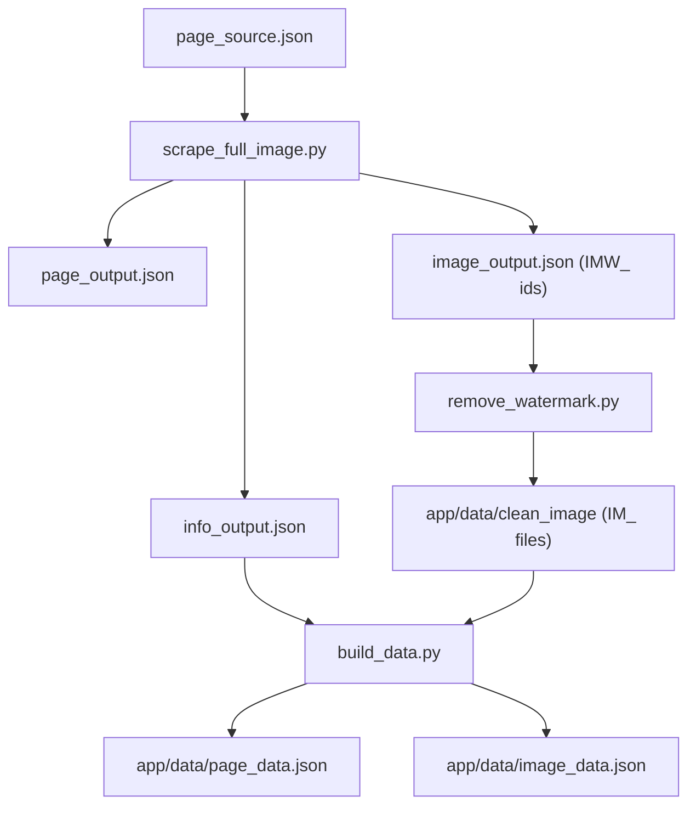

# Data + Image Flow

This file documents the intended end-to-end pipeline for scraping, cleaning, and preparing data for the database.

## Starting Point
- `engine/page_source.json`

## Step 1 — Page Scraper (URL/JSON)
Run:
- `python3 engine/scrape_full_image.py`

Inputs:
- `engine/page_source.json`

Outputs:
- `engine/page_output.json` (all data)
- `engine/info_output.json` (non-image data)
- `engine/image_output.json` (image data; `id` + `url`, with `IMW_` prefix)

## Step 2 — Image Download + Watermark Removal (Images)
Run:
- `python3 engine/remove_watermark.py`

Inputs:
- `engine/image_output.json`

Process:
- Download each image from `image_output.json`
- Remove watermark
- Save cleaned images with `IM_` prefix

Outputs:
- `app/data/clean_image/IM_<id>.<ext>`

## Step 3 — Data Assembly (Database-Ready)
Run:
- `python3 engine/build_data.py`

Inputs:
- `engine/info_output.json`
- `app/data/clean_image/`

Outputs:
- `app/data/page_data.json` (mirrors `info_output.json` with UUID)
- `app/data/image_data.json` (references cleaned image files and links to IDs in `page_data.json`)

## Execution Order
1. `engine/scrape_full_image.py`
2. `engine/remove_watermark.py`
3. `python3 engine/build_data.py`

## End Results
- `app/data/page_data.json`
- Clean images in `app/data/clean_image/`
- `app/data/image_data.json`

## Diagram

