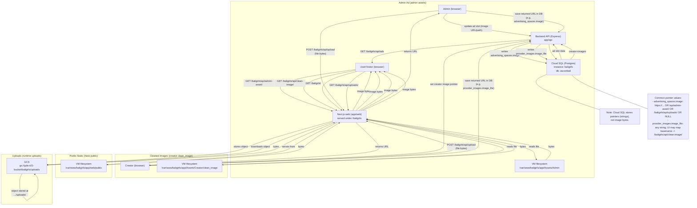

# Image Diagram (Origins + Movement)

This document explains where images originate and how they move through the app at runtime.

```mermaid
flowchart TB
  %% Actors
  A["Admin (browser)"]
  C["Creator (browser)"]
  U["User/Visitor (browser)"]

  %% App services
  NX["Next.js web (app/web)\nserved under /baligirls"]
  API["Backend API (Express)\napp/api"]

  %% Storage
  VM_ASSETS_ADMIN["VM filesystem\n/var/www/baligirls/app/Assets/Admin"]
  VM_CLEAN["VM filesystem\n/var/www/baligirls/app/Assets/Creator/clean_image"]
  VM_PUBLIC["VM filesystem\n/var/www/baligirls/app/web/public"]
  GCS["GCS\ngs://gda-s01-bucket/baligirls/uploads"]
  SQL["Cloud SQL (Postgres)\ninstance: baligirls\ndb: ascortbali"]

  %% Admin assets
  subgraph S1["Admin Ad (admin assets)"]
    U -->|"GET /baligirls/api/admin-asset/<filename>"| NX
    NX -->|"reads file"| VM_ASSETS_ADMIN
    VM_ASSETS_ADMIN -->|"bytes"| NX
    NX -->|"image bytes"| U

    A -->|"update ad slot (image URL/path)"| API
    API -->|"writes advertising_spaces.image"| SQL
    SQL -->|"ad slot data"| API
    API -->|"GET /baligirls/api/ads"| U
  end

  %% Clean images
  subgraph S2["Cleaned Images (creator clean_image)"]
    U -->|"GET /baligirls/api/clean-image/<filename>"| NX
    NX -->|"reads file"| VM_CLEAN
    VM_CLEAN -->|"bytes"| NX
    NX -->|"image bytes"| U

    C -->|"set creator image pointer"| API
    API -->|"writes provider_images.image_file"| SQL
    SQL -->|"creator+images"| API
  end

  %% Public static
  subgraph S3["Public Static (Next public)"]
    U -->|"GET /baligirls/<path>\n(e.g. /placeholders/hero-1.jpg, /logo/logo.png)"| NX
    NX -->|"serves from"| VM_PUBLIC
    VM_PUBLIC -->|"bytes"| NX
    NX -->|"image bytes"| U
  end

  %% Uploads
  subgraph S4["Uploads (runtime uploads)"]
    A -->|"POST /baligirls/api/upload\n(file bytes)"| NX
    C -->|"POST /baligirls/api/upload\n(file bytes)"| NX

    NX -->|"stores object"| GCS
    GCS -->|"object stored at\n.../uploads/<object-key>"| GCS

    NX -->|"returns URL"| A
    NX -->|"returns URL"| C

    A -->|"save returned URL in DB\n(e.g. advertising_spaces.image)"| API
    C -->|"save returned URL in DB\n(e.g. provider_images.image_file)"| API
    API --> SQL

    U -->|"GET /baligirls/api/uploads/<object-key>"| NX
    NX -->|"downloads object"| GCS
    GCS -->|"bytes"| NX
    NX -->|"image bytes"| U
  end

  %% Notes about pointers
  N1["Note: Cloud SQL stores pointers (strings),\nnot image bytes."]
  SQL --- N1

  N2["Common pointer values:\n- advertising_spaces.image: https://... OR /api/admin-asset/<filename> OR /baligirls/api/uploads/<object-key> OR NULL\n- provider_images.image_file: any string; UI may map basename -> /baligirls/api/clean-image/<basename>"]
  SQL --- N2
```
